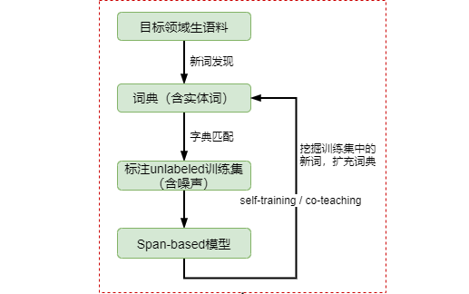

## 基于无监督学习的词汇挖掘

相关任务：领域词汇（术语）挖掘、关键词抽取、新词发现、同义词挖掘、缩略词挖掘

### 统计特征
+ 频次
+ TF-IDF
+ C/NC-value：候选词的长度和嵌套性
+ PMI（自由凝固度）：词的内部凝聚程度
+ 左（右）邻字熵：词的左右邻字的丰富度

### 挖词结果
下面展示的是基于`词频+PMI+左右邻字熵`挖掘的Top-100结果
```
碧瑶
田不易
苏茹
林惊羽
吸血老妖
鬼厉
爷爷
「幽姨
周一仙
齐昊
低声道
王掌柜
陆雪琪
「不错
宋大仁
突然
云易岚
彷佛
贼秃驴
师父
杜必书
焚香谷
青云门
琥珀朱绫
昌合城
彷彿
烧火棍
鬼王
淡淡道
天音寺
淡淡
燕虹
缓缓
青龙
鬼先生
忽然
李洵
张兄弟
半晌
冷冷道
渐渐
凝神戒备
魔教
夔牛
黑暗
轻轻
犹豫
仿佛
周围
刹那间
张师弟
声动四野
悄悄
忍不住
天高云淡
南疆
天琊神剑
熟悉
瞬间
慢慢
尴尬
越来越
狰狞
转过头
哽咽
笼罩
「什麽
深深呼吸
老神仙
张牙舞爪
咯咯
道∶「
石大哥
玄火鉴
负手而立
纷纷
十万大山
继续
消失
眼波流动
欲言又止
开始
「苏师妹
必有后福
呐呐道
流波山
百毒子
毕竟
端木老祖
微笑
似挑逗
似狡诘
鬼王宗
奇怪
守静堂
燃烧
老前辈
唆唆
低声
师兄
```

### 参考
+ https://github.com/yongzhuo/Macropodus
+ https://github.com/smoothnlp/SmoothNLP
+ https://github.com/zhoujx4/NLP-Series-NewWordsMining-PTMPretraining

### 挖词框架 (Todo)


